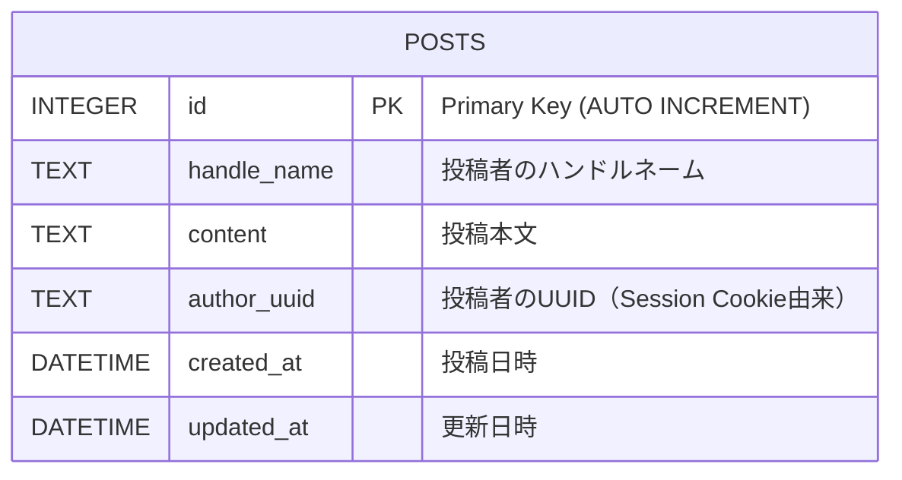

# ER図：ショート投稿掲示板アプリ

## データベース設計



## テーブル詳細

### POSTS テーブル
投稿データを管理するメインテーブル

| カラム名 | データ型 | 制約 | 説明 |
|---------|----------|------|------|
| id | INTEGER | PRIMARY KEY, AUTO INCREMENT | 投稿ID（主キー） |
| handle_name | TEXT | NOT NULL | 投稿者のハンドルネーム |
| content | TEXT | NOT NULL | 投稿本文（短文） |
| author_uuid | TEXT | NOT NULL | 投稿者のUUID（Session Cookie由来） |
| created_at | DATETIME | NOT NULL, DEFAULT CURRENT_TIMESTAMP | 投稿日時 |
| updated_at | DATETIME | NOT NULL, DEFAULT CURRENT_TIMESTAMP | 更新日時 |

## データベース制約

- **主キー制約**: `id`カラムで一意性を保証
- **NOT NULL制約**: 必須項目（handle_name, content, author_uuid, created_at, updated_at）
- **デフォルト値**: created_at, updated_atは自動設定

## UUID簡易認証との関連

- `author_uuid`カラムにSession CookieのUUIDを保存
- 投稿削除時は`author_uuid`とSession CookieのUUIDを照合
- UUIDはブラウザセッション限定（永続化なし）

## 検索・表示パターン

1. **投稿一覧表示**
   ```sql
   SELECT id, handle_name, content, created_at 
   FROM posts 
   ORDER BY created_at DESC;
   ```

2. **投稿詳細表示**
   ```sql
   SELECT id, handle_name, content, author_uuid, created_at 
   FROM posts 
   WHERE id = ?;
   ```

3. **削除権限確認**
   ```sql
   SELECT author_uuid 
   FROM posts 
   WHERE id = ? AND author_uuid = ?;
   ```